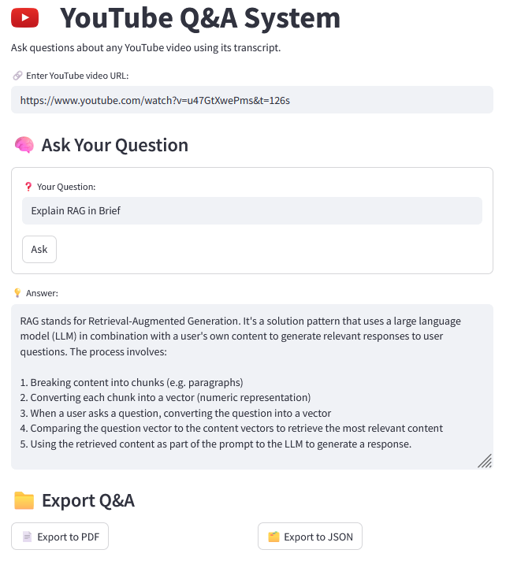

# YouTube Q&A System
 


This project enables users to ask questions about YouTube videos and receive relevant answers by processing the video's transcript. It uses FAISS for vector storage and retrieval, and modular utilities for chunking, embedding, QA, and exporting.

---

## Features

- ✅ Extracts transcripts from YouTube videos
- ✅ Chunks transcripts for better vectorization
- ✅ Embeds and stores chunks using FAISS
- ✅ Answers questions using semantic search and LLMs
- ✅ Exports results if needed
- ✅ Streamlit interface for ease of use

---

## Project Structure

```
├── app.py                    # Streamlit web app
├── main.py                   # Main logic and orchestration
├── chunk_utils.py            # Utilities for chunking transcripts
├── export_utils.py           # Handles exporting of results
├── qa_utils.py               # Core question-answering logic
├── transcript_utils.py       # Download and process YouTube transcripts
├── vector_store_utils.py     # Embedding and ChromaDB vector storage
├── requirements.txt          # Required packages
└── README.md                 # Documentation
```

---

## Getting Started

### 1. Clone the Repository

```bash
git clone https://github.com/yourusername/youtube-qa-system.git
cd youtube-qa-system
```

### 2. Set Up Virtual Environment

```bash
python -m venv venv
# Activate the virtual environment
# On macOS/Linux:
source venv/bin/activate
# On Windows:
venv\Scripts\activate
```

### 3. Install Dependencies

```bash
pip install -r requirements.txt
```

### 4. Run the App

```bash
streamlit run app.py
```

---


---

## How It Works

1. **Transcript Extraction**: `transcript_utils.py` downloads and formats the transcript.
2. **Chunking**: `chunk_utils.py` splits the transcript into overlapping chunks.
3. **Embedding & Storage**: `vector_store_utils.py` embeds and stores chunks in FAISS.
4. **Q&A**: `qa_utils.py` searches for relevant chunks and uses an LLM to generate answers.
5. **Export**: `export_utils.py` handles exporting answers and context if required.

---

## 🧾 Dependencies

See `requirements.txt`. Key libraries include:

- `streamlit`
- `FAISS`
- `openai` or `groq` or any llm-chatmodel
- `youtube-transcript-api`
- `langchain`

---

## Future Improvements

- Multilingual transcript support
- Enhanced semantic chunking
- Customizable embedding models

---

## 👨‍💻 

Developed by Rohit Kumar

Feel free to fork, modify, and contribute!

---


