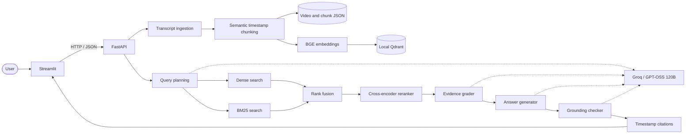

<div align="center">

# 🎬 VideoRAG

**A grounded YouTube question-answering and learning application**

Ask questions, jump to supporting moments, create summaries and notes, and test your understanding with generated quizzes.

[](https://www.python.org/)
[](https://fastapi.tiangolo.com/)
[](https://streamlit.io/)

</div>

---

## Overview

VideoRAG turns a YouTube transcript into a timestamp-aware knowledge source. It combines dense and sparse retrieval, cross-encoder reranking, query planning, evidence grading, grounded generation, and deterministic citations behind a user-focused Streamlit interface.

The project is designed as a complete AI application rather than an isolated retrieval experiment. It includes ingestion, local persistence, conversational Q&A, learning tools, failure handling, tracing, automated tests, and a reproducible evaluation workflow.

## Contents

- [Features](#features)
- [User flow](#user-flow)
- [Architecture](#architecture)
- [Technology stack](#technology-stack)
- [Getting started](#getting-started)
- [API endpoints](#api-endpoints)
- [Configuration](#configuration)
- [Evaluation](#evaluation)
- [Testing](#testing)
- [Project structure](#project-structure)
- [Troubleshooting](#troubleshooting)
- [Documentation](#documentation)

## Features

- **Conversational video Q&A** — ask factual, explanatory, comparative, or follow-up questions.
- **Timestamp citations** — open the supporting part of the YouTube video directly.
- **Hybrid retrieval** — combine semantic BGE embeddings with lexical BM25 search.
- **Cross-encoder reranking** — reorder fused candidates using query–chunk relevance.
- **Query intelligence** — rewrite conversational questions, detect time constraints, and decompose complex requests.
- **Corrective retrieval** — retry once with an improved query when evidence is only partially relevant.
- **Grounding verification** — check generated claims against transcript evidence before returning them.
- **Safe abstention** — return a controlled response when the transcript cannot support an answer.
- **Learning modes** — generate summaries, structured notes, and interactive quizzes.
- **Observability** — record routes, retrieval scores, evidence grades, retries, grounding results, and timings as JSONL traces.

## User flow

1. Paste a YouTube URL.
2. VideoRAG fetches and indexes the timestamped transcript.
3. Ask questions or select Summary, Notes, or Quiz mode.
4. Receive grounded content with clickable evidence timestamps.

The interface keeps retrieval scores, chunk IDs, prompts, and internal reasoning hidden so the experience remains focused on the video and its content.

## Architecture


```mermaid
flowchart LR
    User([User]) --> UI[Streamlit]
    UI -->|HTTP / JSON| API[FastAPI]

    API --> Ingestion[Transcript ingestion]
    Ingestion --> Chunking[Semantic timestamp chunking]
    Chunking --> Files[(Video and chunk JSON)]
    Chunking --> Embeddings[BGE embeddings]
    Embeddings --> Qdrant[(Local Qdrant)]

    API --> Planner[Query planning]
    Planner --> Dense[Dense search]
    Planner --> Sparse[BM25 search]
    Dense --> Fusion[Rank fusion]
    Sparse --> Fusion
    Fusion --> Reranker[Cross-encoder reranker]
    Reranker --> Grader[Evidence grader]
    Grader --> Generator[Answer generator]
    Generator --> Grounding[Grounding checker]
    Grounding --> Citations[Timestamp citations]
    Citations --> UI

    Planner -.-> Groq[Groq / GPT-OSS 120B]
    Grader -.-> Groq
    Generator -.-> Groq
    Grounding -.-> Groq
```

### Question-answering pipeline

1. `QueryRouter` converts the question and recent chat history into a validated query plan.
2. `HybridRetriever` searches normalized dense vectors in Qdrant and a per-video BM25 index.
3. Reciprocal Rank Fusion combines both ranked lists.
4. A cross-encoder reranks the candidates and retains the strongest evidence.
5. `EvidenceGrader` accepts, improves, or rejects the retrieved context.
6. `AnswerGenerator` creates an answer using only the selected transcript evidence.
7. `GroundingChecker` validates the answer and can trigger one constrained regeneration.
8. Verified answers receive deterministic YouTube timestamp citations.

For component boundaries, sequence diagrams, data models, storage, deployment topology, and failure behavior, see [docs/ARCHITECTURE.md](docs/ARCHITECTURE.md).

## Technology stack

| Area | Technology | Purpose |
|---|---|---|
| Language | Python 3.11+ | Application and evaluation code |
| Frontend | Streamlit | Video workspace and interactive learning modes |
| API | FastAPI + Pydantic | Typed routes, validation, and error handling |
| LLM | GPT-OSS 120B through Groq | Planning, grading, generation, and verification |
| Embeddings | `BAAI/bge-base-en-v1.5` | Dense semantic retrieval |
| Sparse retrieval | BM25Okapi | Keyword and exact-term matching |
| Reranking | `cross-encoder/ms-marco-MiniLM-L6-v2` | Final relevance scoring |
| Vector store | Embedded Qdrant | Persistent per-video vector indexes |
| Cache | Redis or in-memory TTL cache | Summary, notes, and quiz caching |
| Testing | pytest | Logic and evaluation tests |

## Getting started

### Prerequisites

- Python 3.11 or newer
- A [Groq](https://groq.com/) API key
- Internet access for transcript retrieval and the initial model downloads

### Installation

```powershell
git clone https://github.com/rohitkr8527/Youtube_Video_Q-A_System.git
cd Youtube_Video_Q-A_System
python -m venv venv
.\venv\Scripts\Activate.ps1
pip install -r requirements.txt
Copy-Item .env.example .env
```

Add your API key to `.env`:

```env
GROQ_API_KEY=your_groq_api_key_here
```

### Start the application

```powershell
python run_app.py
```

Open **http://localhost:8501**. The FastAPI backend runs at **http://127.0.0.1:8000** by default.

To start the services separately:

```powershell
uvicorn app.main:app --reload
streamlit run frontend/app.py
```

## API endpoints

| Method | Endpoint | Description |
|---|---|---|
| `GET` | `/health` | Return service and configuration health |
| `POST` | `/videos/process` | Fetch, chunk, embed, and index a video |
| `GET` | `/videos/{video_id}` | Return stored video metadata |
| `POST` | `/chat` | Answer a question with grounded citations |
| `POST` | `/summary` | Generate a structured video summary |
| `POST` | `/notes` | Generate study notes |
| `POST` | `/quiz` | Generate an interactive quiz |

Interactive API documentation is available at **http://127.0.0.1:8000/docs** while the backend is running.

## Configuration

Settings are loaded from `.env` by `app/config.py`. The provided `.env.example` includes the commonly changed values:

```env
GROQ_API_KEY=your_groq_api_key_here
GROQ_MODEL=openai/gpt-oss-120b
API_HOST=127.0.0.1
API_PORT=8000
STREAMLIT_PORT=8501
QDRANT_PATH=data/qdrant
VIDEO_DATA_PATH=data/videos
TRACE_PATH=data/logs/traces.jsonl
REDIS_URL=
```

Redis is optional. If it is not configured or cannot be reached, VideoRAG automatically uses an in-memory cache.

## Evaluation

VideoRAG includes a timestamp-grounded benchmark with **120 questions across 10 technical videos**: 100 answerable questions and 20 unsupported questions.

| Metric | Result |
|---|---:|
| Recall@1 | **88.0%** |
| Recall@3 | **100.0%** |
| Recall@5 | **100.0%** |
| Mean Reciprocal Rank | **0.933** |
| Faithfulness | **0.985** |
| Answer relevance | **0.989** |
| Timestamp citation hit rate | **52.7%** |
| Abstention accuracy | **90.0%** |

Ground truth comes from stored transcript windows independently of retrieval. The detailed methodology, latency results, per-case output, and limitations are documented in [evaluation/README.md](evaluation/README.md) and [evaluation/results/evaluation_report.md](evaluation/results/evaluation_report.md).

Run the workflow with:

```powershell
python -m evaluation.prepare_ground_truth
python -m evaluation.review_dataset
python -m evaluation.run_benchmark
```

## Testing

```powershell
python -m pytest -q
```

The current suite contains **20 passing tests** covering retrieval fusion, citations, chunking helpers, evaluation metrics, benchmark aggregation, API-limit parsing, and YouTube URL handling. Pure-logic tests do not require live Groq or YouTube requests.

## Project structure

```text
app/
├── api/              FastAPI routes and error translation
├── database/         Qdrant and cache adapters
├── evaluation/       Reusable metric functions
├── generation/       Answers, citations, summaries, notes, and quizzes
├── ingestion/        YouTube access, transcript normalization, and chunking
├── llm/              Groq client and structured-output handling
├── observability/    Metrics and trace recording
├── reasoning/        Planning, rewriting, grading, and grounding
├── retrieval/        Dense search, BM25, fusion, and reranking
├── schemas/          Pydantic data contracts
├── config.py         Environment-backed settings
├── main.py           FastAPI application assembly
└── services.py       Ingestion and RAG orchestration

frontend/             Streamlit interface and API client
evaluation/           Benchmark preparation, execution, and results
tests/                Automated tests
docs/                 Architecture documentation
data/                 Generated local indexes, chunks, and traces
```

## Runtime data

| Path | Contents |
|---|---|
| `data/videos/` | Video metadata and timestamped transcript chunks |
| `data/qdrant/` | Persistent dense-vector collections |
| `data/logs/traces.jsonl` | Structured ingestion and query traces |

These directories are generated locally and excluded from version control. The benchmark depends on the indexed video and Qdrant data while it is running.

## Design scope

- The frontend maintains one active video workspace at a time.
- Qdrant runs in embedded local mode, avoiding a separate database service.
- Sparse indexes and the fallback cache live in process memory.
- Retrieval correction and answer regeneration are each bounded to one attempt.
- The completed benchmark identifies timestamp citation quality and end-to-end latency as the main optimization opportunities.

## Troubleshooting

| Problem | Likely cause | Resolution |
|---|---|---|
| The API reports that it is not ready | `GROQ_API_KEY` is missing or invalid | Check the key in `.env` and restart the processes |
| The first request takes longer | Embedding or reranking models are loading | Allow the initial model download and initialization to finish |
| A video cannot be processed | The URL is invalid or a transcript is unavailable | Verify the URL and try a video with accessible captions |
| Redis cannot be reached | `REDIS_URL` is incorrect or Redis is offline | Clear `REDIS_URL` to use the in-memory fallback |
| An evaluation stops at an API limit | The Groq quota window was reached | Wait for the quota reset and run the command again; successful cases are retained |

## Contributing

Contributions can be developed on a focused branch and submitted through a pull request. Include tests for behavioral changes and keep user-facing responses free of internal retrieval or model details.

```powershell
git checkout -b feature/short-description
python -m pytest -q
```

## Documentation

- [Architecture reference](docs/ARCHITECTURE.md)
- [Evaluation methodology](evaluation/README.md)
- [Evaluation report](evaluation/results/evaluation_report.md)

---

<div align="center">

Built with a focus on **useful answers, verifiable evidence, and measurable system quality**.

</div>
