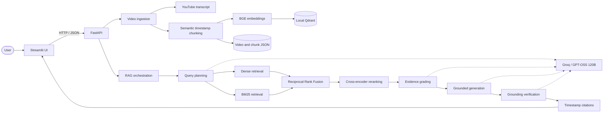

<div align="center">

# 🎬 VideoRAG

### Grounded YouTube intelligence with hybrid retrieval and timestamp citations

Turn a YouTube video into a searchable knowledge source. Ask follow-up questions, verify answers against exact moments, generate study material, and measure retrieval quality through a reproducible evaluation pipeline.

<p>
  
  
  
  
</p>

<p>
  
  
  
  
</p>

<p>
  
  
  
</p>

</div>

---

## Why this project matters

VideoRAG goes beyond a basic vector-search demonstration. It treats retrieval, reasoning, grounding, evaluation, and product behavior as one measurable system.

| Engineering capability | Implementation |
|---|---|
| High-recall search | BGE dense retrieval and BM25 sparse retrieval |
| Ranking quality | Reciprocal Rank Fusion followed by cross-encoder reranking |
| Conversational questions | History-aware query planning and standalone-query rewriting |
| Complex questions | Optional decomposition into multiple search queries |
| Weak evidence | Evidence grading and one bounded corrective search |
| Hallucination control | Grounding verification and one constrained regeneration |
| Verifiable answers | Deterministic citations linked to exact YouTube timestamps |
| Measurable quality | 120-case benchmark covering retrieval, generation, safety, and latency |
| Operability | Structured JSONL traces, persistent indexes, and graceful cache fallback |

## Evaluation results

The completed benchmark contains **120 questions across 10 technical videos** covering machine learning, databases, distributed systems, APIs, MCP, and large language models. It includes 100 timestamp-grounded answerable questions and 20 unsupported questions for abstention testing.

| Category | Metric | Result |
|---|---|---:|
| Retrieval | Recall@1 | **88.0%** |
| Retrieval | Recall@3 | **100.0%** |
| Retrieval | Recall@5 | **100.0%** |
| Retrieval | Mean Reciprocal Rank | **0.933** |
| Answer quality | Faithfulness | **0.985** |
| Answer quality | Answer relevance | **0.989** |
| Grounding | Timestamp citation hit rate | **52.7%** (198/376) |
| Safety | Abstention accuracy | **90.0%** (18/20) |
| Performance | P50 end-to-end latency | **51.95 s** |
| Performance | P95 end-to-end latency | **85.75 s** |

No answerable case missed the ground-truth range at Recall@5, so the benchmark produced no eligible initial miss from which to measure corrective-retrieval recovery.

Ground truth was generated from stored transcript windows independently of the retriever. Faithfulness and relevance were judged using the question, reference answer, generated answer, and retrieved evidence. The full methodology and outputs are available in [evaluation/README.md](evaluation/README.md) and [evaluation/results/evaluation_report.md](evaluation/results/evaluation_report.md).

> **Result summary:** VideoRAG retrieved the correct timestamp range within its top five results for every answerable benchmark case while maintaining 0.985 faithfulness and 90% abstention accuracy.

## Product experience

- Paste a YouTube URL and index its transcript.
- Ask factual, explanatory, comparative, and timestamp-specific questions.
- Continue a conversation without repeating the original context.
- Open cited evidence directly at the relevant point in the video.
- Generate a structured summary or study notes.
- Take an interactive multiple-choice quiz generated from the video.
- Receive a clear refusal when the available transcript does not support an answer.

The interface intentionally hides vector scores, prompts, chunk identifiers, model internals, and reasoning state. Users see the video, the answer, and the supporting timestamps.

## System architecture


```mermaid
flowchart LR
    User([User]) --> UI[Streamlit UI]
    UI -->|HTTP / JSON| API[FastAPI]

    API --> Ingest[Video ingestion]
    API --> RAG[RAG orchestration]

    Ingest --> YT[YouTube transcript]
    Ingest --> Chunk[Semantic timestamp chunking]
    Chunk --> Embed[BGE embeddings]
    Embed --> Qdrant[(Local Qdrant)]
    Chunk --> Files[(Video and chunk JSON)]

    RAG --> Plan[Query planning]
    Plan --> Dense[Dense retrieval]
    Plan --> Sparse[BM25 retrieval]
    Dense --> Fusion[Reciprocal Rank Fusion]
    Sparse --> Fusion
    Fusion --> Rerank[Cross-encoder reranking]
    Rerank --> Grade[Evidence grading]
    Grade --> Generate[Grounded generation]
    Generate --> Verify[Grounding verification]
    Verify --> Cite[Timestamp citations]
    Cite --> UI

    Plan -.-> LLM[Groq / GPT-OSS 120B]
    Grade -.-> LLM
    Generate -.-> LLM
    Verify -.-> LLM
```

The detailed component, sequence, data-model, storage, deployment, and evaluation diagrams are documented in [docs/ARCHITECTURE.md](docs/ARCHITECTURE.md).

## Request lifecycle

1. The router converts the question and chat history into a strict query plan.
2. Dense and sparse retrieval run against the selected video's chunks.
3. Reciprocal Rank Fusion merges both rankings.
4. A cross-encoder reranks the candidates and selects the strongest evidence.
5. The evidence grader either accepts the context, improves the query, or rejects it.
6. GPT-OSS 120B generates an evidence-bound answer.
7. A grounding check validates the answer against the retrieved transcript.
8. Verified answers receive deterministic timestamp citations; unsupported answers are withheld.

## Technology stack

| Layer | Technology | Role |
|---|---|---|
| Frontend | Streamlit | Single-video workspace, chat, notes, summaries, and quizzes |
| API | FastAPI + Pydantic | Typed HTTP contracts and service boundary |
| LLM | `openai/gpt-oss-120b` through Groq | Planning, grading, generation, and verification |
| Dense retrieval | `BAAI/bge-base-en-v1.5` | Normalized semantic embeddings |
| Sparse retrieval | BM25Okapi | Exact-term and lexical retrieval |
| Reranking | `cross-encoder/ms-marco-MiniLM-L6-v2` | Query–chunk relevance scoring |
| Vector storage | Embedded Qdrant | Persistent per-video vector collections |
| Cache | Redis or in-memory TTL cache | Summary, notes, and quiz reuse |
| Observability | Structured JSONL tracing | Stage timings, routes, scores, and retry outcomes |
| Testing | pytest | Deterministic unit and benchmark-metric tests |

## Repository structure

```text
app/
├── api/              FastAPI routes and error translation
├── database/         Qdrant and cache adapters
├── evaluation/       Reusable retrieval metrics
├── generation/       Answers, citations, summaries, notes, and quizzes
├── ingestion/        YouTube access, transcript processing, and chunking
├── llm/              Groq model client and structured-output handling
├── observability/    Metrics and trace recording
├── reasoning/        Planning, query rewriting, evidence grading, and grounding
├── retrieval/        Dense search, BM25, fusion, and reranking
├── schemas/          Pydantic transport and domain models
├── config.py         Environment-backed settings
├── main.py           FastAPI application assembly
└── services.py       Ingestion and RAG orchestration

frontend/             Streamlit interface and API client
evaluation/           Benchmark preparation, execution, and results
tests/                Automated tests
docs/                 Detailed architecture documentation
data/                 Generated local indexes, chunks, and traces
```

## Quick start

### Requirements

- Python 3.11 or newer
- A [Groq](https://groq.com/) API key
- Internet access for YouTube transcripts and the first model download

### Installation

```powershell
git clone <repository-url>
cd Youtube_Video_Q-A_System
python -m venv venv
.\venv\Scripts\Activate.ps1
pip install -r requirements.txt
Copy-Item .env.example .env
```

Set the API key in `.env`:

```env
GROQ_API_KEY=your_groq_api_key_here
```

Start the API and Streamlit interface together:

```powershell
python run_app.py
```

Open **http://localhost:8501**. FastAPI runs at **http://127.0.0.1:8000** by default.

### Run services separately

```powershell
uvicorn app.main:app --reload
streamlit run frontend/app.py
```

## API surface

| Method | Endpoint | Purpose |
|---|---|---|
| `GET` | `/health` | Report service and configuration health |
| `POST` | `/videos/process` | Fetch, chunk, embed, and index a video |
| `GET` | `/videos/{video_id}` | Return stored video metadata |
| `POST` | `/chat` | Produce a grounded answer with citations |
| `POST` | `/summary` | Generate a video summary |
| `POST` | `/notes` | Generate study notes |
| `POST` | `/quiz` | Generate an interactive quiz |

## Evaluation workflow

```powershell
python -m evaluation.prepare_ground_truth
python -m evaluation.review_dataset
python -m evaluation.run_benchmark
```

The evaluation produces:

```text
evaluation/results/raw_results.jsonl
evaluation/results/metrics.json
evaluation/results/evaluation_report.md
```

Successful case IDs are checkpointed in the raw results, allowing interrupted or quota-limited runs to continue without repeating completed evaluations.

## Tests

```powershell
python -m pytest -q
```

Current test status: **20 passing tests**. The tests cover chunking helpers, retrieval fusion, citation construction, retrieval metrics, benchmark aggregation, quota parsing, and YouTube URL handling without requiring live Groq or YouTube requests.

## Configuration and storage

Configuration is loaded from `.env` through `app/config.py`. The main settings cover the Groq model, ports, embedding and reranking models, chunk sizes, candidate counts, retry limits, storage paths, and optional Redis connection.

Generated runtime data is stored locally:

| Path | Contents |
|---|---|
| `data/videos/` | Video metadata and timestamped transcript chunks |
| `data/qdrant/` | Persistent dense-vector collections |
| `data/logs/traces.jsonl` | Structured ingestion and query traces |

Qdrant runs in embedded local mode, so no external vector-database service is required. When Redis is unavailable, generated-content caching falls back to process memory.

## Engineering trade-offs

- The frontend focuses on one active video at a time, keeping the interaction model simple and explicit.
- Embedded Qdrant removes infrastructure overhead but favors a single local API process.
- Dense and sparse retrieval improve recall at the cost of model initialization and reranking latency.
- Grounding checks and bounded retries improve reliability while increasing end-to-end response time.
- The current benchmark shows perfect Recall@5 but also identifies timestamp citation precision and latency as the clearest areas for further optimization.

---

<div align="center">

**Built as an end-to-end AI engineering system: retrieval, reasoning, grounding, evaluation, and product delivery.**

</div>
