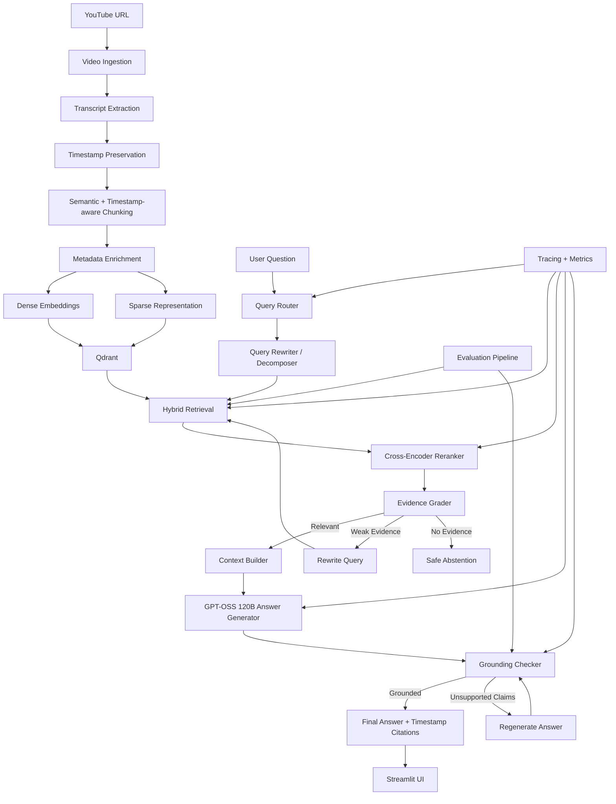
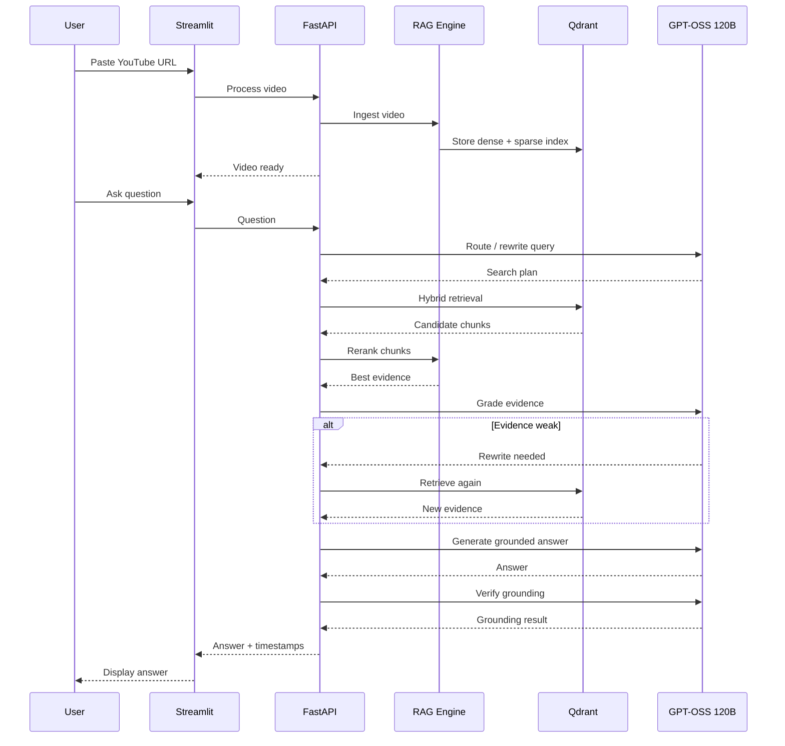

# VideoRAG — Final Architecture & Tech Stack

## 1. Project Goal

**VideoRAG** is an advanced YouTube RAG system designed to understand long-form videos and answer user questions with grounded, timestamp-backed responses.

The project should demonstrate strong AI engineering concepts without making the product feel technical to the end user.

The system combines:

- Timestamp-aware ingestion
- Semantic chunking
- Hybrid retrieval
- Cross-encoder reranking
- Query rewriting
- Agentic routing
- Self-corrective RAG
- Grounded answer generation
- RAG evaluation
- Observability
- User-focused Streamlit frontend

> Multi-video / playlist support is intentionally excluded for now.

---

# 2. Final Architecture



---

# 3. Core RAG Flow

## Step 1 — Video Ingestion

Input:

```text
YouTube URL
```

The system extracts:

- Video ID
- Video title
- Transcript
- Start time of each transcript segment
- Duration of each transcript segment
- Video URL

If transcript extraction fails in a later version, Whisper can be used as fallback.

---

## Step 2 — Timestamp-Aware Semantic Chunking

The current basic project merges the whole transcript into plain text.

That should be replaced.

Each chunk should preserve metadata like:

```json
{
  "video_id": "abc123",
  "title": "Example Video",
  "chunk_id": 42,
  "start_time": 754.2,
  "end_time": 789.5,
  "topic": "Hybrid Retrieval",
  "text": "..."
}
```

Chunking should combine:

- semantic boundaries
- transcript timestamps
- overlap between nearby sections

### Recommended initial settings

```text
Target chunk size: 500–800 tokens
Overlap: 80–120 tokens
```

Exact values should be benchmarked using the evaluation pipeline.

---

# 4. Retrieval Architecture

## 4.1 Dense Retrieval

Dense retrieval is used for semantic meaning.

Example:

```text
User:
How does he improve search quality?

Transcript:
The system uses a second-stage relevance model...
```

Even without exact keyword overlap, dense retrieval can find the relevant content.

### Embedding Model

Recommended:

```text
BAAI/bge-base-en-v1.5
```

Alternative:

```text
intfloat/e5-base-v2
```

---

## 4.2 Sparse Retrieval

Sparse retrieval helps with:

- exact names
- technical terms
- code names
- numbers
- acronyms
- uncommon keywords

Examples:

```text
FAISS
PostgreSQL
RRF
JWT
12.5%
```

Sparse retrieval complements dense semantic search.

---

## 4.3 Hybrid Search

The retrieval layer combines:

```text
Dense Search
+
Sparse Search
```

Results are fused before reranking.

Recommended fusion method:

```text
Reciprocal Rank Fusion (RRF)
```

Initial retrieval:

```text
Dense candidates: 15–20
Sparse candidates: 15–20
Combined candidates: ~20
```

---

# 5. Cross-Encoder Reranking

Hybrid search should optimize recall.

The reranker should optimize final relevance.

Flow:

```text
20 retrieved chunks
        ↓
Cross-Encoder
        ↓
Top 4–6 chunks
```

Recommended model:

```text
cross-encoder/ms-marco-MiniLM-L6-v2
```

The reranker scores:

```text
Question + Chunk
```

together instead of comparing independent embeddings.

This gives better final context selection.

---

# 6. Query Understanding

## 6.1 Query Router

Every user request should not use the same pipeline.

The router identifies the request type.

Supported routes:

```text
FACTUAL_QA
SUMMARY
NOTES
QUIZ
TIMESTAMP_QUERY
COMPARISON
EXPLANATION
```

Examples:

```text
"What is RAG?"
→ FACTUAL_QA

"Summarize the video"
→ SUMMARY

"Make detailed notes"
→ NOTES

"Quiz me"
→ QUIZ

"What did he explain around 20 minutes?"
→ TIMESTAMP_QUERY
```

The router is implemented using:

```text
GPT-OSS 120B
```

with structured output.

---

# 7. Query Rewriting

Conversation questions are often incomplete.

Example:

```text
User:
What is vector search?

User:
Why did he choose it?
```

The second question should be rewritten internally to something like:

```text
Why did the speaker choose vector search?
```

Query rewriting uses:

```text
GPT-OSS 120B
```

The frontend never exposes rewritten queries.

---

# 8. Query Decomposition

Complex questions may require multiple searches.

Example:

```text
How is dense retrieval different from sparse retrieval,
and why does he combine them?
```

Internal decomposition:

```text
1. What is dense retrieval?
2. What is sparse retrieval?
3. Why are dense and sparse retrieval combined?
```

Each query retrieves evidence.

Results are then fused and reranked.

Use decomposition only when necessary.

---

# 9. Agentic RAG

The project should use **agentic decision-making**, not a large multi-agent system.

The system should decide:

- what type of query it received
- whether rewriting is necessary
- whether decomposition is necessary
- which retrieval strategy to use
- whether retrieved evidence is strong enough
- whether another retrieval attempt is needed
- whether the final answer is grounded

This is the agentic layer.

Do **not** create unnecessary agents such as:

```text
Manager Agent
Search Agent
Critic Agent
Research Agent
Writer Agent
```

The project should stay controlled and explainable.

---

# 10. Self-Corrective RAG

Self-corrective retrieval is one of the main differentiators of the project.

## Evidence Grading

After reranking:

```text
Question
+
Top retrieved chunks
        ↓
GPT-OSS 120B Evidence Grader
```

Possible states:

```text
RELEVANT
PARTIALLY_RELEVANT
IRRELEVANT
```

---

## Relevant

Continue normally:

```text
Evidence
↓
Answer Generation
```

---

## Partially Relevant

The system performs one corrective retrieval attempt.

```text
Weak Evidence
     ↓
Rewrite Search Query
     ↓
Hybrid Retrieval Again
     ↓
Rerank Again
```

---

## Irrelevant

The system should not hallucinate.

Return a user-friendly answer such as:

```text
I couldn't find enough information in this video to answer that reliably.
```

---

## Retry Limits

Avoid uncontrolled loops.

```python
MAX_RETRIEVAL_RETRIES = 1
MAX_GENERATION_RETRIES = 1
```

---

# 11. Grounded Answer Generation

The final answer generator receives only the highest-quality evidence.

Model:

```text
GPT-OSS 120B via Groq
```

The answer must:

- use only retrieved evidence
- avoid unsupported claims
- answer naturally
- include timestamp references
- say when evidence is insufficient

---

# 12. Grounding Checker

After generation:

```text
Generated Answer
+
Retrieved Evidence
        ↓
GPT-OSS 120B Grounding Check
```

The checker verifies:

```text
Are the important claims supported by the retrieved evidence?
```

If yes:

```text
Return answer
```

If no:

```text
Remove unsupported claims
or
Regenerate answer
```

Only one regeneration attempt should be allowed.

---

# 13. Timestamp Citations

Every useful factual answer should include video timestamps.

Example:

```text
The speaker recommends combining dense and sparse retrieval
because they capture different types of relevance.

Sources:
18:42–19:16
21:04–21:31
```

Timestamp links should open the YouTube video at the corresponding moment.

Example URL format:

```text
https://youtube.com/watch?v=VIDEO_ID&t=1122s
```

This is much more useful to users than showing:

```text
similarity_score=0.84
chunk_id=128
```

Technical retrieval data should remain hidden from the user.

---

# 14. RAG Evaluation System

The project must include a proper evaluation layer.

Create an evaluation dataset containing:

```text
question
expected answer
relevant timestamps
expected source chunks
```

Example:

```json
{
  "question": "Why does the speaker use hybrid retrieval?",
  "expected_answer": "...",
  "relevant_timestamps": [1120, 1195]
}
```

---

## Retrieval Metrics

Measure:

- Recall@K
- Precision@K
- MRR
- NDCG

Compare:

```text
Dense only
vs
Sparse only
vs
Hybrid
vs
Hybrid + Reranker
```

This is important because upgrades should be measurable.

---

## Generation Evaluation

Measure:

- answer relevance
- faithfulness
- context relevance
- hallucination rate

RAGAS can be used where useful, together with custom evaluation logic.

---

# 15. Observability

The backend should internally track:

```text
Original query
Rewritten query
Query route
Retrieved chunks
Dense rankings
Sparse rankings
Fusion result
Reranker scores
Evidence grade
Generation latency
Retrieval latency
Total latency
Token usage
Correction triggered
Grounding result
```

This information should be available for development and debugging.

It should **not** appear in the normal Streamlit interface.

---

# 16. LLM Strategy

Use only:

```text
openai/gpt-oss-120b
```

Provider:

```text
Groq
```

Use GPT-OSS 120B for:

- query routing
- query rewriting
- query decomposition
- evidence grading
- answer generation
- grounding verification
- self-correction
- summaries
- notes generation
- quiz generation

No second LLM model should be used.

---

# 17. Final Tech Stack

| Layer | Technology |
|---|---|
| Language | Python 3.11+ |
| Frontend | Streamlit |
| Backend/API | FastAPI |
| LLM | GPT-OSS 120B |
| LLM Provider | Groq |
| Embeddings | BGE Base / SentenceTransformers |
| Vector Database | Qdrant |
| Sparse Retrieval | BM25 / Qdrant Sparse |
| Retrieval Fusion | Reciprocal Rank Fusion |
| Reranker | CrossEncoder |
| Transcript Source | YouTube Transcript API |
| Video Metadata | YouTube / yt-dlp utilities |
| Caching | Redis |
| Validation | Pydantic |
| Evaluation | RAGAS + custom metrics |
| Testing | Pytest |
| Logging | Python structured logging |
| Observability | Custom tracing / OpenTelemetry-compatible tracing |
| Configuration | `.env` + Pydantic Settings |

---

# 18. Streamlit Frontend Principles

The frontend must be completely user-focused.

Do not expose:

```text
Qdrant
Groq
GPT-OSS
BM25
RRF
Embedding model
CrossEncoder
Chunk IDs
Vector scores
Retrieval scores
Agent names
CRAG states
Token usage
Internal prompts
```

The user should only see information useful for understanding the video.

---

# 19. Visual Design

Use a YouTube-inspired dark interface.

Recommended visual direction:

```text
Background: near-black
Cards: dark gray
Accent: YouTube-style red
Primary text: white
Secondary text: muted gray
Borders: subtle gray
```

Avoid:

- childish emojis
- excessive gradients
- technical dashboards
- unnecessary animations
- oversized decorative elements
- AI buzzwords in the UI

---

# 20. Landing Screen

The first screen should contain:

```text
VideoRAG

Understand any YouTube video.

Ask questions, find important moments,
create notes, summaries and quizzes.

[ Paste a YouTube URL ]

[ Analyze Video ]
```

Keep it minimal.

---

# 21. Main Application Layout

Desktop layout:

```text
┌──────────────────────────────────────────────────────────────┐
│ VideoRAG                                         New Video   │
├───────────────────────────────┬──────────────────────────────┤
│                               │                              │
│                               │ Ask about this video         │
│        YouTube Video          │                              │
│                               │ Conversation                 │
│                               │                              │
│                               │                              │
│                               │                              │
│                               │ Ask anything...              │
├───────────────────────────────┴──────────────────────────────┤
│ Ask          Summary          Notes          Quiz            │
└──────────────────────────────────────────────────────────────┘
```

Recommended desktop ratio:

```text
Video: 55%
Chat: 45%
```

---

# 22. User Modes

## Ask

Normal conversational Q&A.

Starter suggestions:

```text
What is this video about?

What are the key ideas?

Explain the hardest concept simply.

What should I remember from this video?
```

---

## Summary

Output structure:

```text
Overview

Key Ideas

Important Details

Main Takeaways
```

Include timestamps where useful.

---

## Notes

Generate structured learning notes.

Example:

```text
Topic 1

Explanation

Important points

Example

Timestamp
```

---

## Quiz

Interactive quiz using Streamlit session state.

Features:

- one question at a time
- multiple-choice answers
- submit/check answer
- explanation after answering
- score tracking
- next question

Do not simply print ten questions as Markdown.

---

# 23. Processing UX

Do not show technical steps such as:

```text
Creating embeddings...
Connecting to Qdrant...
Running BM25...
Reranking chunks...
```

Show user-friendly progress:

```text
Preparing your video

Reading the video
Understanding the content
Preparing it for questions
```

---

# 24. Recommended Project Structure

```text
video-rag/
│
├── app/
│   │
│   ├── api/
│   │   ├── routes_chat.py
│   │   ├── routes_video.py
│   │   └── routes_health.py
│   │
│   ├── ingestion/
│   │   ├── youtube.py
│   │   ├── transcript.py
│   │   ├── chunker.py
│   │   └── metadata.py
│   │
│   ├── retrieval/
│   │   ├── embeddings.py
│   │   ├── dense.py
│   │   ├── sparse.py
│   │   ├── hybrid.py
│   │   ├── fusion.py
│   │   └── reranker.py
│   │
│   ├── reasoning/
│   │   ├── router.py
│   │   ├── query_rewriter.py
│   │   ├── query_decomposer.py
│   │   ├── evidence_grader.py
│   │   └── grounding_checker.py
│   │
│   ├── generation/
│   │   ├── answer.py
│   │   ├── summary.py
│   │   ├── notes.py
│   │   ├── quiz.py
│   │   └── citations.py
│   │
│   ├── evaluation/
│   │   ├── dataset.py
│   │   ├── retrieval_metrics.py
│   │   ├── generation_metrics.py
│   │   └── evaluator.py
│   │
│   ├── observability/
│   │   ├── tracing.py
│   │   ├── metrics.py
│   │   └── logging.py
│   │
│   ├── database/
│   │   ├── qdrant.py
│   │   └── redis.py
│   │
│   ├── llm/
│   │   ├── groq_client.py
│   │   └── prompts.py
│   │
│   ├── schemas/
│   │   ├── chat.py
│   │   ├── video.py
│   │   └── retrieval.py
│   │
│   ├── config.py
│   └── main.py
│
├── frontend/
│   ├── app.py
│   ├── components/
│   ├── pages/
│   ├── styles/
│   └── state.py
│
├── evaluation/
│   ├── datasets/
│   └── results/
│
├── tests/
│   ├── unit/
│   ├── integration/
│   └── evaluation/
│
├── scripts/
│
├── requirements.txt
├── .env.example
├── .gitignore
└── README.md
```

---

# 25. FastAPI Responsibilities

FastAPI should handle:

```text
POST /videos/process
POST /chat
GET  /videos/{id}
POST /summary
POST /notes
POST /quiz
GET  /health
```

Streamlit communicates with FastAPI.

The Streamlit app should not directly contain the complete RAG implementation.

This keeps:

```text
UI
Backend
Retrieval
Reasoning
Evaluation
```

properly separated.

---

# 26. Data Flow



---

# 27. Important Engineering Rules

## Rule 1

Do not call GPT-OSS 120B when deterministic code can solve the task.

Examples:

```text
timestamp formatting
URL generation
score sorting
RRF calculation
metadata filters
```

Use Python for these.

---

## Rule 2

Do not run self-correction for every query.

Only trigger it when evidence quality is insufficient.

---

## Rule 3

Do not expose internal reasoning to users.

The frontend receives only:

```text
answer
sources
timestamps
status
```

---

## Rule 4

Every important generated claim must come from retrieved video evidence.

---

## Rule 5

Prefer abstention over hallucination.

---

## Rule 6

Evaluation must compare system versions.

Example:

```text
Baseline RAG
↓
+ Semantic chunking
↓
+ Hybrid retrieval
↓
+ Reranking
↓
+ Query rewriting
↓
+ Corrective RAG
```

Record whether each change improves measurable performance.

---

# 28. Development Phases

## Phase 1 — Strong Retrieval Foundation

Build:

- timestamp-aware ingestion
- semantic chunking
- BGE embeddings
- Qdrant
- sparse retrieval
- hybrid retrieval
- RRF
- cross-encoder reranking

---

## Phase 2 — Advanced RAG Intelligence

Build:

- GPT-OSS 120B integration
- query router
- query rewriting
- query decomposition
- evidence grading
- corrective retrieval
- grounded generation
- grounding verification

---

## Phase 3 — Product Experience

Build:

- new Streamlit UI
- video/chat split layout
- timestamp sources
- Ask mode
- Summary mode
- Notes mode
- Quiz mode
- loading states
- session state

---

## Phase 4 — Evaluation

Build:

- evaluation dataset
- retrieval metrics
- generation evaluation
- baseline comparisons
- experiment results

---

## Phase 5 — Production Engineering

Build:

- Redis caching
- API validation
- retry/error handling
- structured logging
- tracing
- tests
- local service launcher
- README
- architecture documentation

---

# 29. Final Scope

The final project should contain these nine major AI engineering capabilities:

1. Timestamp-aware semantic chunking
2. Qdrant persistent vector storage
3. Dense + sparse hybrid retrieval
4. Cross-encoder reranking
5. Query rewriting and decomposition
6. Agentic query routing
7. Self-corrective retrieval and grounded generation
8. RAG evaluation framework
9. Observability and tracing

Additional product capabilities:

- Ask video questions
- Timestamp-backed answers
- Video summaries
- Structured notes
- Interactive quizzes

Not included for now:

```text
Multi-video knowledge bases
Playlist ingestion
Large multi-agent architecture
```

---

# 30. Final Project Positioning

Do not position the project as:

> Chat with YouTube using LangChain.

Position it as:

> **VideoRAG — an agentic, self-corrective RAG system for long-form video understanding using timestamp-aware semantic chunking, hybrid retrieval, cross-encoder reranking, adaptive query processing, grounded generation, evaluation, and citation-backed answers.**

The engineering value should come from:

```text
retrieval quality
+
reasoning workflow
+
self-correction
+
evaluation
+
observability
+
product quality
```

rather than simply calling an LLM API.


---

## Implementation note for this build

Qdrant uses persistent local mode through `qdrant-client`, and `python run_app.py` starts the FastAPI and Streamlit processes locally.
