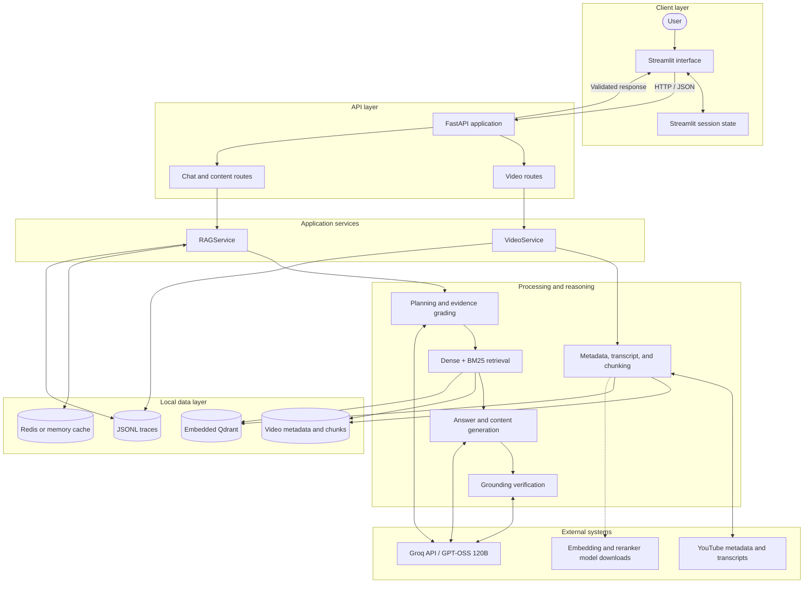
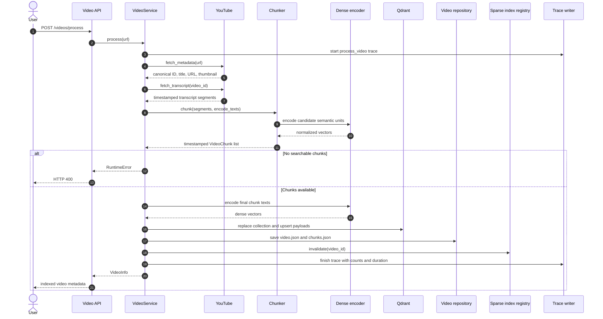
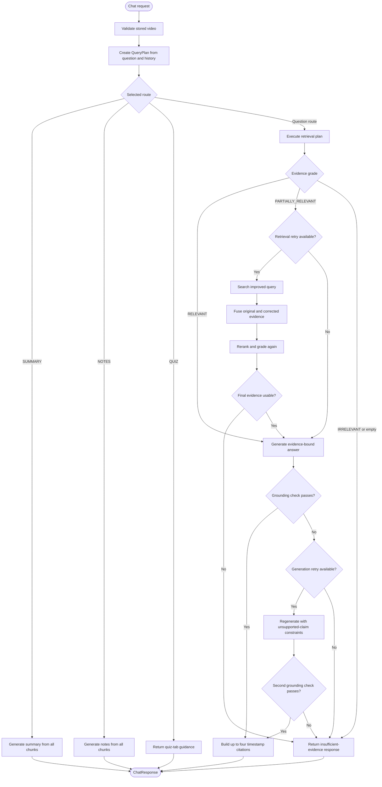
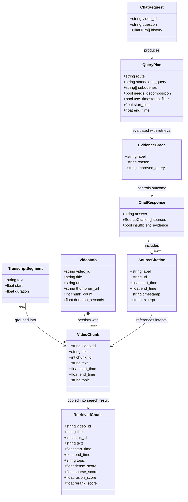
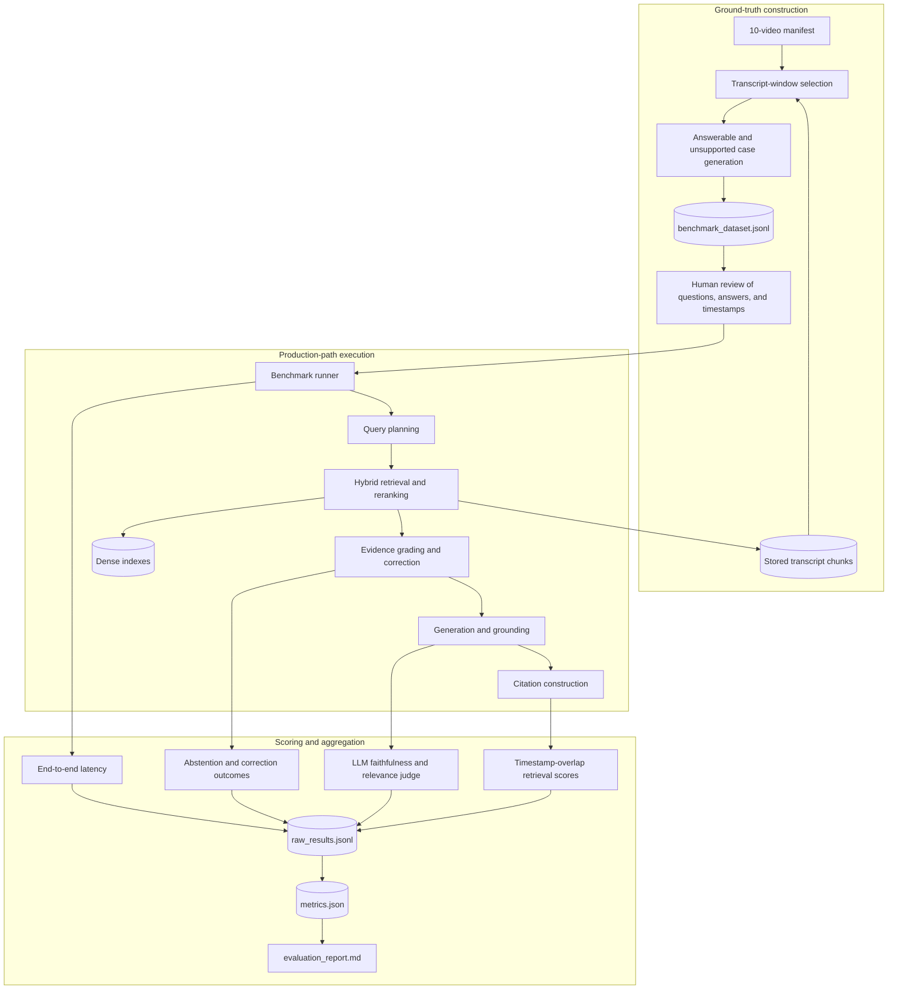
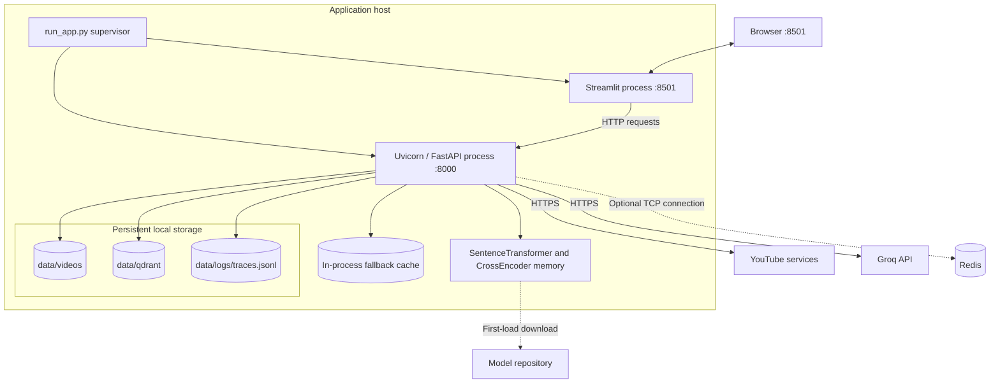
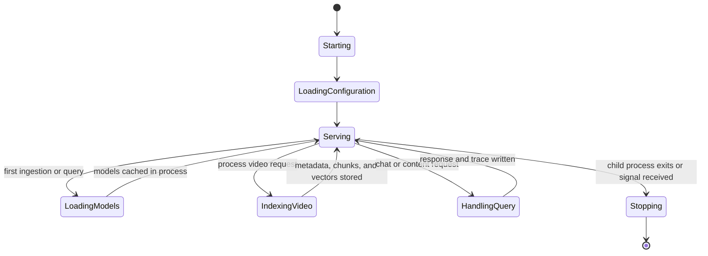

# VideoRAG Architecture

## System overview

VideoRAG is a single-video retrieval-augmented generation system for YouTube content. A Streamlit client communicates with a FastAPI backend that ingests transcripts, builds local search indexes, retrieves timestamped evidence, and uses a Groq-hosted language model to produce grounded responses.

The system has two primary runtime paths:

- **Video ingestion** converts a YouTube transcript into timestamp-aware chunks and indexes them.
- **Content generation** answers questions or creates summaries, notes, and quizzes from stored transcript material.



The API layer contains no retrieval or generation logic. Route handlers validate transport models, translate exceptions into HTTP responses, and delegate work to the two application services. The service layer owns orchestration, while specialized modules implement ingestion, retrieval, reasoning, and generation.

## Runtime components

| Component | Responsibility | Main location |
|---|---|---|
| Streamlit frontend | Video entry, chat, summaries, notes, quizzes, and timestamp links | `frontend/` |
| FastAPI application | HTTP boundary, validation, routing, and error translation | `app/main.py`, `app/api/` |
| Video service | Metadata retrieval, transcript fetching, chunking, embedding, and indexing | `app/services.py` |
| RAG service | Query planning, retrieval, evidence grading, generation, and grounding | `app/services.py` |
| Local repository | Video metadata and transcript-chunk persistence | `app/ingestion/metadata.py` |
| Dense vector store | Per-video cosine-similarity search | `app/database/qdrant.py` |
| Sparse index registry | In-memory per-video BM25 indexes | `app/retrieval/sparse.py` |
| LLM client | Structured and text generation through Groq | `app/llm/groq_client.py` |
| Cache | Redis-backed or in-memory generated-content cache | `app/database/redis.py` |
| Tracing | JSONL operation events and durations | `app/observability/tracing.py` |

## Video ingestion

`VideoService.process()` owns the ingestion transaction.



### Transcript model

Raw transcript entries are normalized into `TranscriptSegment` objects with text, start time, and duration. The final video duration is calculated from the latest segment boundary.

### Chunking

`SemanticTimestampChunker` groups transcript segments while retaining start and end times. It combines token-size targets, overlap, topic hints, and embedding similarity to find useful boundaries. The default configuration is:

| Setting | Default |
|---|---:|
| Target chunk size | 650 approximate tokens |
| Minimum chunk size | 350 approximate tokens |
| Maximum chunk size | 800 approximate tokens |
| Overlap | 100 approximate tokens |
| Semantic boundary quantile | 0.25 |

Each `VideoChunk` carries its video ID, numeric chunk ID, text, timestamps, and topic metadata.

### Index persistence

The dense index uses one Qdrant collection per video. Reprocessing a video replaces its collection before inserting the new vectors. Chunk payloads are stored alongside normalized BGE embeddings, allowing search results to reconstruct complete `RetrievedChunk` objects.

Video metadata and chunks are also stored as JSON under `data/videos/<video_id>/`. This filesystem representation supplies the sparse index, content generators, and evaluation workflow.

## Question-answering flow

`RAGService.chat()` coordinates the full grounded-answer path.



The same path viewed as a component interaction sequence makes the bounded correction loops explicit:

```mermaid
sequenceDiagram
    autonumber
    actor User
    participant UI as Streamlit
    participant API as Chat API
    participant RAG as RAGService
    participant QR as QueryRouter
    participant HR as HybridRetriever
    participant EG as EvidenceGrader
    participant AG as AnswerGenerator
    participant GC as GroundingChecker
    participant CI as Citation builder
    participant TR as Trace writer

    User->>UI: submit question
    UI->>API: POST /chat
    API->>RAG: chat(ChatRequest)
    RAG->>QR: plan(question, history)
    QR-->>RAG: QueryPlan
    RAG->>TR: record route and normalized queries
    RAG->>HR: retrieve planned query set
    HR-->>RAG: reranked evidence
    RAG->>EG: grade(standalone query, evidence)
    EG-->>RAG: EvidenceGrade

    alt Evidence is partially relevant and retry is enabled
        RAG->>HR: retrieve improved query
        HR-->>RAG: corrected evidence
        RAG->>RAG: fuse and rerank both result sets
        RAG->>EG: grade combined evidence
        EG-->>RAG: final EvidenceGrade
    end

    alt Evidence is irrelevant or empty
        RAG->>TR: finish with insufficient_evidence
        RAG-->>API: controlled refusal
    else Evidence is usable
        RAG->>AG: generate(question, evidence, history)
        AG-->>RAG: candidate answer
        RAG->>GC: check(question, answer, evidence)
        GC-->>RAG: GroundingResult

        opt Answer is ungrounded and retry is enabled
            RAG->>AG: regenerate with unsupported-claim constraints
            AG-->>RAG: revised answer
            RAG->>GC: check revised answer
            GC-->>RAG: final GroundingResult
        end

        alt Final answer is grounded
            RAG->>CI: build_citations(evidence)
            CI-->>RAG: SourceCitation list
            RAG->>TR: finish with route, evidence, and retry metrics
            RAG-->>API: grounded ChatResponse
        else Final answer is ungrounded
            RAG->>TR: finish with verification failure
            RAG-->>API: controlled refusal without citations
        end
    end

    API-->>UI: JSON response
    UI-->>User: answer and timestamp links
```



The retrieval plan inside the orchestration flow has its own ranking stages:

```mermaid
flowchart LR
    Query["Standalone query"] --> Expand{"Decomposition enabled?"}
    Expand -->|"No"| Q1["Primary search query"]
    Expand -->|"Yes"| QN["Primary query + subqueries"]

    subgraph PerQuery["Hybrid retrieval for each query"]
        Encode["BGE query encoding"]
        Dense["Qdrant cosine search"]
        Tokenize["Sparse tokenization"]
        BM25["BM25 search"]
        RRF1["Reciprocal Rank Fusion"]
        Ranker1["Cross-encoder reranking"]
        Encode --> Dense --> RRF1
        Tokenize --> BM25 --> RRF1
        RRF1 --> Ranker1
    end

    Q1 --> Encode
    Q1 --> Tokenize
    QN --> Encode
    QN --> Tokenize
    Ranker1 --> Multi{"Multiple ranked lists?"}
    Multi -->|"No"| TopK["Top reranked evidence"]
    Multi -->|"Yes"| RRF2["Cross-query fusion"]
    RRF2 --> Ranker2["Rerank with merged query text"]
    Ranker2 --> TopK
```



### Query planning

`QueryRouter` converts the current question and conversation history into a strict `QueryPlan`. The plan describes:

- the selected route;
- a standalone query with resolved conversational context;
- optional subqueries for decomposed questions; and
- optional start and end times for timestamp-constrained retrieval.

Summary, notes, and quiz intents are routed separately from ordinary question answering. The chat endpoint can recognize those intents, while the frontend also exposes dedicated modes.

### Hybrid retrieval

`HybridRetriever` runs dense and sparse retrieval for the same query:

- **Dense retrieval** uses normalized `BAAI/bge-base-en-v1.5` embeddings and cosine similarity in local Qdrant.
- **Sparse retrieval** uses `BM25Okapi` over tokenized chunks loaded from the video repository.
- **Fusion** combines ranked lists through Reciprocal Rank Fusion with `k=60`.
- **Reranking** scores query–chunk pairs with `cross-encoder/ms-marco-MiniLM-L6-v2` and returns the configured top results.

Timestamp filters use interval overlap. Dense search applies Qdrant payload conditions, while sparse search filters candidate chunks against the same requested time range.

The default candidate counts are 20 dense results, 20 sparse results, and 6 reranked results.

### Decomposed queries

When a plan contains subqueries, each search query runs through the hybrid retriever. Their outputs are fused again, then reranked against text containing the primary query and subqueries. This preserves a single evidence list for downstream grading and generation.

### Corrective retrieval

`EvidenceGrader` classifies retrieved evidence as `RELEVANT`, `PARTIALLY_RELEVANT`, or `IRRELEVANT`.

- Relevant evidence proceeds to answer generation.
- Partially relevant evidence can trigger one search using the grader's improved query. Original and corrected results are fused and reranked before another grade.
- Irrelevant or empty evidence produces a controlled insufficient-evidence response.

The retry limit is configured through `MAX_RETRIEVAL_RETRIES` and defaults to one.

### Answer grounding

`AnswerGenerator` receives the question, retrieved chunks, and conversation history. `GroundingChecker` then evaluates whether the generated claims are supported by that evidence.

An ungrounded answer can be regenerated once with the unsupported claims supplied as a correction constraint. A second failed grounding check replaces the generated text with a controlled response and omits citations. `MAX_GENERATION_RETRIES` controls this behavior and defaults to one.

### Citations

Citation construction is deterministic. `build_citations()` converts the top evidence chunks into `SourceCitation` objects containing labels, timestamps, snippets, and YouTube URLs with `t=<seconds>` parameters. A grounded chat response includes up to four citations.

## Generated content modes

Summary, notes, and quiz generation operate on all stored chunks for the selected video rather than the question-retrieval path.

| Mode | Output | Cache key |
|---|---|---|
| Summary | Structured content with sources | `summary:<video_id>` |
| Notes | Structured study notes with sources | `notes:<video_id>` |
| Quiz | Structured interactive questions | `quiz:<video_id>` |

Generated content is cached for one hour. A configured Redis instance provides the shared cache; otherwise the process uses an in-memory TTL cache.

## API boundary

FastAPI exposes synchronous route handlers backed by cached service instances.

| Method | Endpoint | Request | Response |
|---|---|---|---|
| `GET` | `/health` | None | Service and configuration state |
| `POST` | `/videos/process` | `ProcessVideoRequest` | `VideoInfo` |
| `GET` | `/videos/{video_id}` | Path ID | `VideoInfo` |
| `POST` | `/chat` | `ChatRequest` | `ChatResponse` |
| `POST` | `/summary` | `ContentRequest` | `ContentResponse` |
| `POST` | `/notes` | `ContentRequest` | `ContentResponse` |
| `POST` | `/quiz` | `ContentRequest` | `QuizResponse` |

Pydantic schemas define the transport contracts in `app/schemas/`. API errors translate missing videos to HTTP 404, invalid ingestion input to 422 or 400, unavailable LLM configuration to 503, and unexpected processing failures to generic 500 responses.

CORS permits the default Streamlit origins at `localhost:8501` and `127.0.0.1:8501`.

## State and storage

The central data contracts connect ingestion, retrieval, generation, and the HTTP layer without exposing storage-specific objects across those boundaries.



`RetrievedChunk` extends the stored chunk payload with optional scores from each ranking stage. That lets fusion and reranking retain provenance without changing the persisted `VideoChunk` representation. API responses expose citations rather than raw chunks or ranking scores.

```text
data/
├── videos/
│   └── <video_id>/
│       ├── video.json
│       └── chunks.json
├── qdrant/
│   └── collection data
└── logs/
    └── traces.jsonl
```

| State | Lifetime | Persistence |
|---|---|---|
| Video metadata and chunks | Across application runs | JSON files |
| Dense vector collections | Across application runs | Local Qdrant files |
| Sparse BM25 indexes | Process lifetime | In-memory registry |
| Summary, notes, and quiz cache | One-hour TTL | Redis or process memory |
| Service/model instances | Process lifetime | `lru_cache` singletons |
| Operation traces | Across application runs | Append-only JSONL |

The frontend maintains the active video, chat history, selected mode, and quiz state in Streamlit session state. The interface presents user-facing content and citations while retrieval scores, chunk IDs, prompts, and reasoning metadata remain backend concerns.

### State ownership

| Owner | State | Consistency behavior |
|---|---|---|
| `VideoRepository` | Video metadata and canonical chunk lists | Files are replaced when a video is processed |
| `DenseVectorStore` | Embedded vectors and chunk payloads | The per-video collection is recreated during indexing |
| `SparseIndexRegistry` | BM25 corpus and scores | Built lazily from chunk files and invalidated after ingestion |
| `Cache` | Generated summaries, notes, and quizzes | Entries expire after one hour |
| Streamlit session | Active video and interactive UI state | Isolated to the browser session |
| Trace writer | Completed operation records | Append-only writes protected by a process-local lock |

## Observability

Each ingestion and chat operation creates a `Trace` with a unique ID. Timed spans and structured events are appended to `data/logs/traces.jsonl` under a process-local write lock.

Ingestion traces include metadata, transcript, chunking, embedding, and indexing durations. Chat traces include the route, retrieval scores, evidence grades, retry counts, grounding state, retrieved chunk IDs, and total duration.

`QueryMetrics` holds the route and retry/grounding state accumulated during a chat request before it is copied into the final trace record.

## Evaluation architecture

The evaluation package contains a 120-case benchmark across 10 videos. Answerable cases include timestamp ranges derived from stored transcript windows; unsupported cases measure abstention behavior.



The benchmark executes the production query-planning, retrieval, grading, generation, grounding, and citation stages. It records retrieval quality, answer quality, grounding behavior, corrective-retrieval outcomes, and latency.

| Category | Metrics |
|---|---|
| Retrieval | Recall@1/3/5 and MRR |
| Answer quality | Faithfulness and answer relevance |
| Grounding | Timestamp citation hit rate |
| Safety | Abstention accuracy on unsupported questions |
| Correction | Recovery rate after an initial Recall@5 miss |
| Performance | P50 and P95 end-to-end latency |

Successful case results remain in `raw_results.jsonl`, allowing later executions to skip those case IDs. Aggregate files are written after the available benchmark cases finish processing.

## Configuration

`app/config.py` loads settings from environment variables and `.env`.

| Area | Variables |
|---|---|
| LLM | `GROQ_API_KEY`, `GROQ_MODEL`, `GROQ_TIMEOUT_SECONDS` |
| HTTP | `API_HOST`, `API_PORT`, `STREAMLIT_PORT`, `REQUEST_TIMEOUT_SECONDS` |
| Models | `EMBEDDING_MODEL`, `RERANKER_MODEL` |
| Storage | `QDRANT_PATH`, `VIDEO_DATA_PATH`, `TRACE_PATH`, `REDIS_URL` |
| Chunking | `TARGET_CHUNK_TOKENS`, `MIN_CHUNK_TOKENS`, `MAX_CHUNK_TOKENS`, `OVERLAP_TOKENS`, `SEMANTIC_BOUNDARY_QUANTILE` |
| Retrieval | `DENSE_CANDIDATES`, `SPARSE_CANDIDATES`, `RERANK_TOP_K` |
| Controls | `MAX_RETRIEVAL_RETRIES`, `MAX_GENERATION_RETRIES` |

`run_app.py` starts Uvicorn and Streamlit as child processes, monitors both, and terminates the remaining process when either exits. The default backend and frontend ports are 8000 and 8501.

## Process and deployment topology

The default deployment is local and consists of two application processes sharing filesystem-backed data. Qdrant runs inside the API process through the Python client rather than as a network service.



The API process owns the model singletons, Qdrant client, sparse-index registry, and fallback cache. Multiple API workers would therefore have separate model memory, sparse indexes, and in-memory cache entries while still sharing the configured filesystem paths. Redis provides shared generated-content caching when present, but Qdrant's embedded local mode remains oriented toward a single API process accessing its storage path.

### Runtime lifecycle



## Failure behavior

| Condition | System behavior |
|---|---|
| Invalid or unsupported YouTube URL | Ingestion returns a validation/client error |
| Missing transcript or unusable chunks | Video processing stops without creating a searchable video |
| Missing video files or vector collection | API returns a not-found response |
| Missing Groq configuration | Generation endpoints return service unavailable |
| Empty or irrelevant evidence | Chat returns an insufficient-evidence response |
| Failed grounding after regeneration | Chat returns a verification-failure response without citations |
| Redis unavailable | Cache falls back to process memory |
| Groq quota reached during evaluation | Completed successful rows remain available for a later run |

## Module map

```text
app/
├── api/              HTTP routes and error translation
├── database/         Qdrant and cache adapters
├── evaluation/       Reusable metric functions
├── generation/       Answer, citation, summary, notes, and quiz generation
├── ingestion/        YouTube access, transcript normalization, chunking, persistence
├── llm/              Groq model adapter
├── observability/    Metrics and trace recording
├── reasoning/        Query planning, rewriting, grading, and grounding
├── retrieval/        Dense search, BM25, fusion, and reranking
├── schemas/          Pydantic data contracts
├── config.py         Environment-backed configuration
├── main.py           FastAPI assembly
└── services.py       Ingestion and RAG orchestration

frontend/
├── api_client.py     Backend client
├── app.py            Streamlit modes and page flow
├── components.py     Shared UI components
├── state.py          Session state
└── styles.py         Visual styling

evaluation/
├── benchmark_dataset.jsonl
├── benchmark_models.py
├── metric_utils.py
├── prepare_ground_truth.py
├── review_dataset.py
├── run_benchmark.py
├── video_manifest.json
└── results/
```

## Architectural boundaries

- The active frontend workspace represents one video at a time.
- Video transcript retrieval and model downloads require network access; indexed-video querying uses local retrieval plus Groq generation.
- Qdrant operates in embedded local mode rather than as a separate service.
- Sparse indexes and fallback content caches are process-local and are rebuilt after application restarts.
- Query reasoning and answer generation use a single configured Groq model.
- Corrective retrieval and answer regeneration are deliberately bounded to keep latency and model usage predictable.
